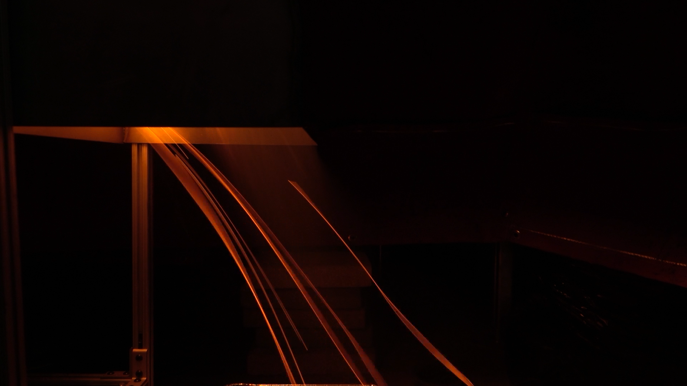
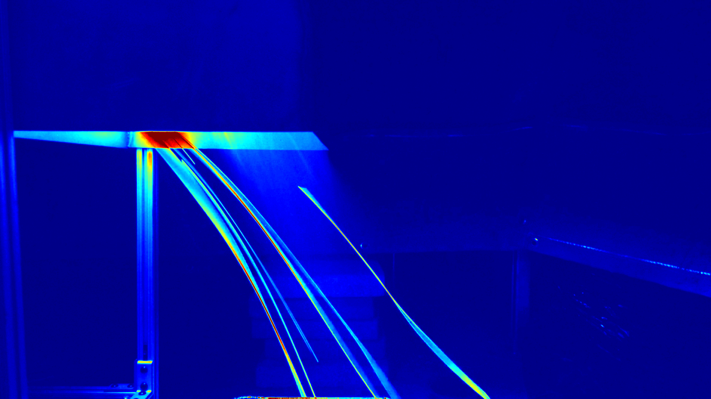

# Pyrometry image processing

## Temperature maps

**Grayscale pyrometry:** currently basic; uses grayscale opencv import, then just applies a jet filter. Doesn't yet copy the full impl in the paper.

**Ratio pyrometry:** pretty damn close to what's in the paper but it's very broken atm

**Test image:**

**Grayscale pyrometry result:**

