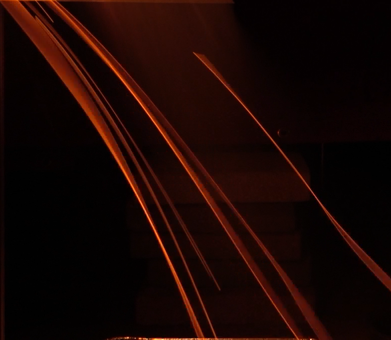
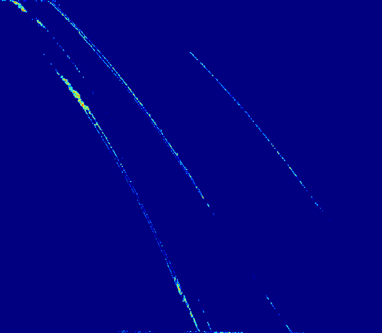
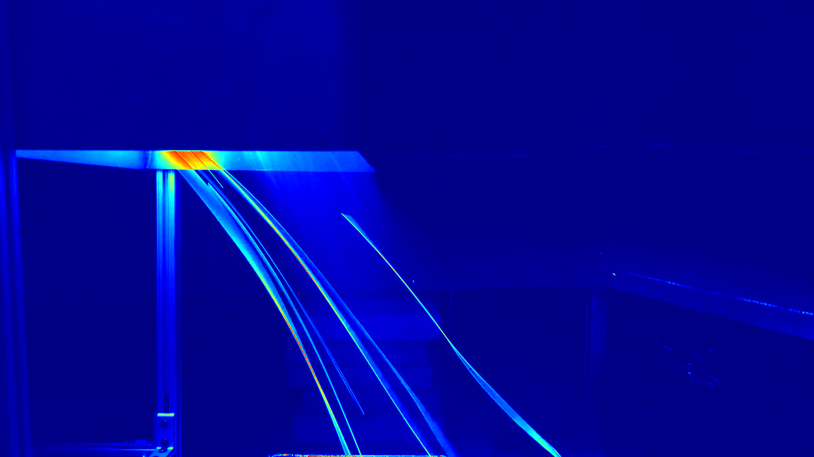

# Pyrometry image processing

## Interface Screenshots

| Input View | Results | 
| --- | --- |
|  | 

## Developing the web frontend

To serve in production:

```
gunicorn flask_frontend:app
```

To autoreload on source file changes:

```
gunicorn flask_frontend:app --reload
```

## Temperature maps

**Grayscale pyrometry:** currently basic; uses grayscale opencv import, then just applies a jet filter. Doesn't yet copy the full impl in the paper.

**Ratio pyrometry:** pretty damn close to what's in the paper but it's very broken atm

**Test image:**



**Ratio pyrometry result (with convolutional smoothing):**

According to general researcher consensus, ratio pyrometry is supposed to be more accurate.



**Grayscale pyrometry result:**


