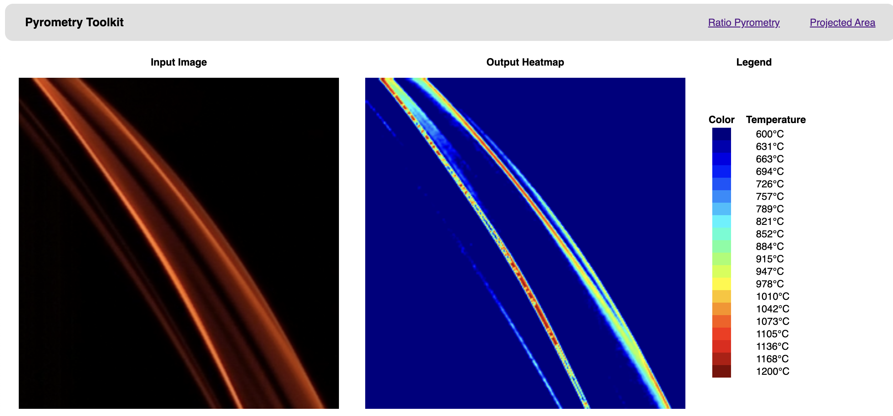

# Pyrometry image processing

## Interface Screenshots

| Input View | Results | 
| --- | --- |
|  | 

## Using the web version 

1. Go to [pyro.turtlebasket.ml](https://pyro.turtlebasket.ml).
2. Select an input image.
3. Enter your DSLR camera settings.
4. Click "Generate Heatmap".

## Using the local (batch) version

Create a new config file:

```
cp config.example.yaml config.yaml
```

...then edit the values to match your DSLR camera settings. Standard config syntax is:

```yaml
---
# camera settings
iso: 64
i-darkcurrent: 7.7
exposure-time: 0.5
f-stop: 2.4

# pyrometry settings
min-temp: 600
max-temp: 1200
scaling-factor: 0.55

# output settings
smoothing-radius: 2
```

Install dependencies:

```
pipenv install
```

...then load images into `images-input`. Run:

```
pipenv run python3 batch-process.py
```

...and find outputs in `images-output`.

## Developing the web frontend

To serve in production:

```
gunicorn flask_frontend:app
```

To autoreload on source file changes:

```
gunicorn flask_frontend:app --reload
```
